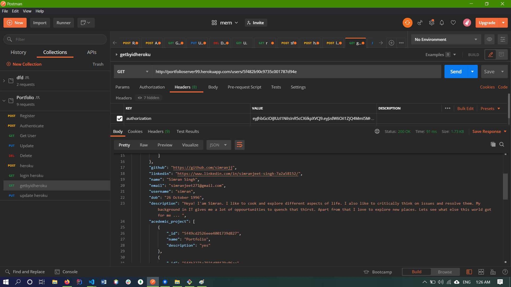

# Online Portfolio Generator
Easy way to build Portfolio

## GetById API
+ GET : http://localhost:4007/users/{objectID}

## Update User API
+ PUT : http://localhost:4007/users/{objectID}
+ BODY:{
  "name": "simran",
  "email": "simran@gmail.com",
  "username":"simran",
  "dob": "2020-07-12T05:24:16.530Z",
  "description": "software Developer",
  "skills": 
    {
    "front_end":["vue","react"], 
    "back_end":["node"],
    "database":["mongo"]
    }
} 

## Create User API
+ POST : http://localhost:4007/users/register
+ BODY : {
  "name": "simran",
  "email": "simran@gmail.com",
  "username":"simran",
  "password": "abc",
  "dob": "2020-07-12T05:24:16.530Z",
  "description": "description",
  "skills": 
    {
    "front_end":["react"], 
    "back_end":["node"],
    "database":["mongo"]
    },
  "acedemic_project": [
     {
      "name": "Portfolio Generator",
      "description": "just an another project"
     }
  ],
  "professional_experience": [
    {
      "company": "XYZ",
      "description":" Software Developer",
      "time_period":5
    }
  ],
  "achievements": [
    {
      "name": "Gold Badge",
      "description": "Problem Solving",
      "time": 5
    }
  ],
  "certificates": [
    {
      "name": "Random",
      "time":6
    }
  ]
}

## Authenticate User API
+ POST: http://localhost:4007/users/authenticate

## Delete User API
+ POST: http://localhost:4007/users/{objectID}
+ BODY: {
  "username":"abc",
  "password": "abc" 
}

## Screenshot

## Thank you
